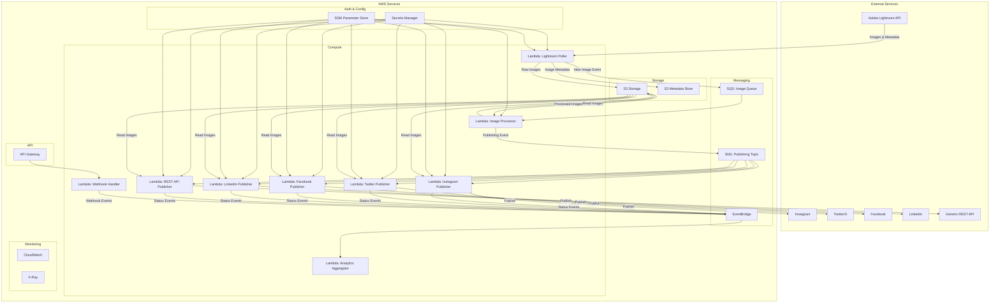

# SocialOmega

SocialOmega is an event-driven microservice architecture that automatically pulls images from Adobe Lightroom and distributes them to various social networks. Built on AWS serverless services like Lambda and S3, the system provides a scalable, cost-effective solution for social media management.

## Architecture Overview

SocialOmega uses a completely event-driven architecture where each component responds to events from other parts of the system. This ensures loose coupling between services and enables independent scaling and deployment.

## Core Components

### Services

1. **Lightroom Poller Service**
   - Lambda function that polls Adobe Lightroom API for new images
   - Stores raw images to S3
   - Sends image metadata to S3 metadata store
   - Triggers processing pipeline via SQS

2. **Image Processor Service**
   - Lambda function triggered by SQS messages
   - Resizes and optimizes images for different social platforms
   - Applies filters or transformations as needed
   - Sends publish events to SNS topic

3. **Social Media Publishers**
   - Separate Lambda functions for each social platform (Instagram, Twitter, Facebook, LinkedIn)
   - Triggered by SNS notifications
   - Handles platform-specific publishing requirements
   - Reports publishing status to EventBridge

4. **REST API Publisher**
   - Generic Lambda function for publishing to any REST API
   - Configurable for different API endpoints and authentication methods
   - Transforms metadata to match target API's requirements
   - Handles retry logic and error reporting

5. **Analytics Aggregator**
   - Processes publishing status events from EventBridge
   - Aggregates engagement metrics from social platforms
   - Stores analytics data for reporting

6. **Webhook Handler**
   - Receives callbacks from social platforms via API Gateway
   - Processes engagement notifications (likes, comments, shares)
   - Forwards relevant events to EventBridge

### Storage

1. **S3 Image Buckets**
   - Raw images from Adobe Lightroom
   - Processed images for each social platform
   - Version control for image revisions

2. **S3 Metadata Store**
   - Stores image metadata (tags, captions, etc.)
   - Maintains publishing history and status
   - Links between original and processed images

### Event Flow

1. **Image Detection Flow**
   - Lightroom Poller detects new images
   - Raw images stored in S3
   - Image metadata queued for processing

2. **Processing Flow**
   - Image Processor optimizes images for each platform
   - Creates platform-specific variants
   - Sends publishing notifications

3. **Publishing Flow**
   - Platform-specific publishers receive publishing events
   - Images posted to respective social networks
   - Generic REST API publisher handles custom integrations
   - Publishing status reported back to system

4. **Analytics Flow**
   - Publishing events captured in EventBridge
   - Webhook events from social platforms processed
   - Analytics aggregated and stored

## Implementation Details

### AWS Services Utilized

- **AWS Lambda**: Serverless compute for all microservices
- **Amazon S3**: Storage for images and metadata
- **Amazon SQS**: Message queuing for decoupling services
- **Amazon SNS**: Pub/sub messaging for publishing events
- **Amazon EventBridge**: Event bus for system-wide events
- **AWS Secrets Manager**: Secure storage for API credentials
- **AWS Systems Manager Parameter Store**: Configuration management
- **Amazon API Gateway**: Webhook endpoints for social platforms
- **Amazon CloudWatch**: Monitoring and logging
- **AWS X-Ray**: Distributed tracing

### Generic REST API Integration

The REST API Publisher provides a flexible integration point for any system with a REST API:

1. **Configuration-Driven**
   - API endpoint URLs stored in Parameter Store
   - Authentication credentials in Secrets Manager
   - Transformation templates for different API formats

2. **Capabilities**
   - Supports various authentication methods (OAuth, API keys, Basic Auth)
   - Handles multipart form uploads for images
   - Configurable content types and headers
   - Response validation and error handling

3. **Use Cases**
   - Custom CMS integration
   - Digital asset management systems
   - Marketing automation platforms
   - E-commerce product catalogs
   - Proprietary content management systems

### Configuration and Security

All sensitive credentials (API keys, tokens) are stored in AWS Secrets Manager:
- Adobe Lightroom API credentials
- Social media platform access tokens
- REST API authentication credentials

Configuration parameters are stored in SSM Parameter Store:
- Polling frequency
- Image processing parameters
- Platform-specific settings
- REST API endpoint configuration

### Error Handling and Resilience

1. **Dead Letter Queues**
   - Capture failed processing attempts
   - Enable retry or manual intervention

2. **Circuit Breakers**
   - Prevent cascade failures when endpoints are unavailable
   - Implement backoff strategies for API rate limits

3. **Event Sourcing**
   - Store all events for auditability
   - Enable replay of events for recovery

## Deployment

SocialOmega is deployed using infrastructure as code with AWS CloudFormation or AWS CDK. Each microservice is independently deployable, allowing for continuous delivery of individual components without affecting the entire system.

## Local Development

1. Install the AWS SAM CLI
2. Clone the repository
3. Set up local environment variables
4. Use SAM local invoke to test functions
5. Use localstack for simulating AWS services

## Future Enhancements

- Add support for additional social media platforms
- Implement AI-based optimal posting time prediction
- Add content moderation before publishing
- Create a dashboard for monitoring and analytics
- Implement A/B testing for post variants
- Expand REST API capabilities for broader integration options
