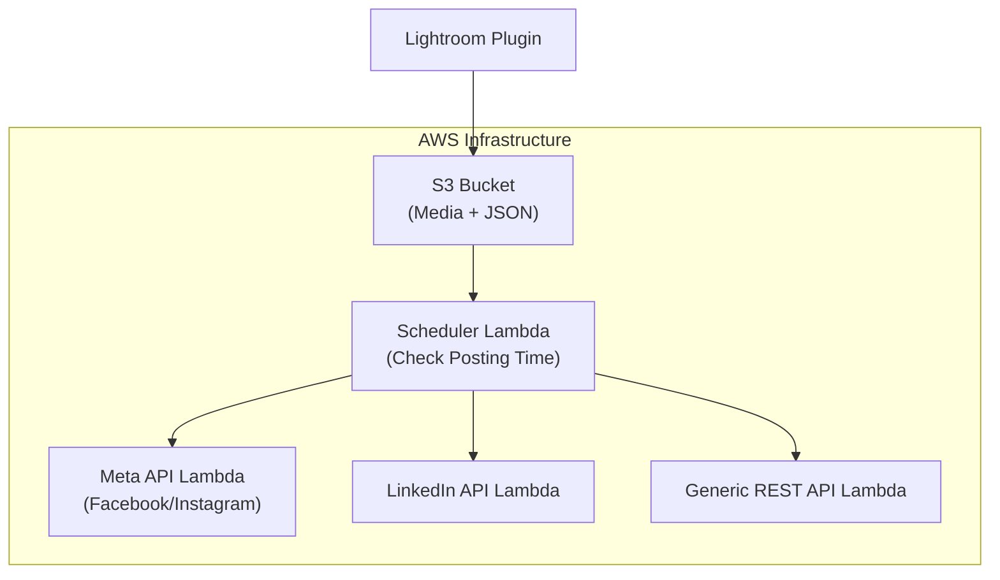

# AWS Social Media Manager

A modular AWS infrastructure for scheduling and posting media content to various social media platforms. This solution uses AWS Lambda functions, S3 storage, and includes an Adobe Lightroom plugin for seamless integration into your content workflow.

## Architecture



## Features

- **Schedule-based posting** to multiple social media platforms
- **Modular architecture** with separate Lambda functions for each platform
- **Adobe Lightroom integration** for direct export to the scheduling system
- **Complete infrastructure as code** using Terraform
- **Secure credential management** via AWS Parameter Store
- **Customizable post parameters** including captions, hashtags, and scheduling
- **Support for custom REST APIs** enabling integration with any platform

## Components

### AWS Resources

- **S3 Bucket**: Stores media files and scheduling information
- **Lambda Functions**:
  - Scheduler: Checks which posts are due and triggers the appropriate platform handler
  - Meta API Handler: Posts to Facebook and Instagram
  - LinkedIn API Handler: Posts to LinkedIn
  - Generic REST API Handler: Flexible handler for any REST API-based platform
- **CloudWatch Events**: Triggers the scheduler periodically
- **Parameter Store**: Securely stores API credentials
- **IAM Roles and Policies**: Manages permissions for Lambda functions

### File Structure

- `posts_schedule.json`: Central configuration file that contains all scheduled posts
- `/media`: Directory for all media files to be posted

## Setup Instructions

### Prerequisites

- AWS Account with appropriate permissions
- Terraform installed (v1.0+)
- AWS CLI configured
- [Optional] Adobe Lightroom Classic for plugin integration

### Deployment Steps

1. **Clone this repository**:
   ```bash
   git clone https://github.com/yourusername/aws-social-media-manager.git
   cd aws-social-media-manager
   ```

2. **Prepare Lambda function packages**:
   ```bash
   # Create deployment packages for each Lambda function
   cd src/lambda
   ./create_packages.sh
   cd ../..
   ```

3. **Deploy with Terraform**:
   ```bash
   terraform init
   terraform plan -out=tfplan
   terraform apply tfplan
   ```

4. **Configure API credentials in Parameter Store**:
   - Navigate to AWS Systems Manager > Parameter Store
   - Create the following parameters (use SecureString type):
     - `/social-media/facebook/page_id`
     - `/social-media/facebook/access_token`
     - `/social-media/instagram/page_id`
     - `/social-media/instagram/access_token`
     - `/social-media/linkedin/person_id`
     - `/social-media/linkedin/access_token`

5. **Install Lightroom Plugin** (optional):
   - Copy the `S3MediaUploader.lrdevplugin` directory to your Lightroom plugins directory
   - In Lightroom, go to File > Plug-in Manager > Add and select the plugin
   - Configure the plugin with your AWS credentials and bucket name

### Initial Configuration

After deployment, an empty `posts_schedule.json` file will be created in your S3 bucket. The file follows this structure:

```json
{
  "posts": [
    {
      "filename": "sunset_beach.jpg",
      "platform": "instagram",
      "text": "Beautiful sunset at the beach today!",
      "tags": ["sunset", "beach", "nature", "photography"],
      "scheduled_time": "2023-06-01T18:00:00Z",
      "published": false
    },
    ...
  ]
}
```

## Usage

### Scheduling Posts Manually

1. Upload your media file to the S3 bucket in the `media/` directory
2. Add an entry to the `posts_schedule.json` file with:
   - Filename
   - Target platform
   - Caption text
   - Tags (optional)
   - Scheduled time in ISO 8601 format

### Using the Lightroom Plugin

1. Select photos in Lightroom
2. Go to File > Export
3. Select "Upload to Social Media via S3" as the export method
4. Configure the export settings:
   - Select the target platform
   - Enter caption text and tags
   - Set the scheduled time
5. Click Export

### Post Format

The `posts_schedule.json` file supports the following fields:

| Field | Description | Required |
|-------|-------------|----------|
| filename | Name of the media file in the S3 bucket | Yes |
| platform | Target platform (facebook, instagram, linkedin, custom) | Yes |
| text | Post caption or message | Yes |
| tags | Array of hashtags to include | No |
| scheduled_time | ISO 8601 timestamp for when to post | Yes |
| published | Whether the post has been published (set by system) | No |
| endpoint | Custom API endpoint URL (for custom platform only) | For custom platform |
| auth_type | Authentication type for custom API | For custom platform |
| request_type | Request format for custom API | For custom platform |
| additional_fields | Extra fields for custom API requests | No |

## Custom API Integration

To integrate with a custom platform that provides a REST API:

1. Set `platform` to `"custom"`
2. Provide an `endpoint` URL
3. Specify `auth_type` from:
   - `"bearer"`: Uses Bearer token authentication
   - `"basic"`: Uses Basic authentication
   - `"api_key"`: Uses API key in header
   - `"custom"`: Uses both API key and secret in headers
4. Specify `request_type` from:
   - `"multipart"`: For multipart/form-data requests (most common)
   - `"json_base64"`: For JSON payload with base64-encoded media
   - `"binary"`: For raw binary file upload
   - `"json"`: For standard JSON payload

## Security Considerations

- All API credentials are stored securely in AWS Parameter Store
- The S3 bucket is configured with private access
- Lambda functions operate with the principle of least privilege
- Content is transferred securely using HTTPS

## Troubleshooting

### Common Issues

1. **Posts not being published**:
   - Check CloudWatch Logs for errors in the Lambda functions
   - Verify the scheduled time is in ISO 8601 format and in UTC
   - Ensure API credentials are correctly set in Parameter Store

2. **Lightroom plugin errors**:
   - Verify AWS credentials are correctly entered in plugin settings
   - Check that the S3 bucket name matches your deployed bucket

3. **Permission errors**:
   - Ensure the Lambda execution role has necessary permissions
   - Verify S3 bucket policy allows the required operations

## Contributing

Contributions are welcome! Please feel free to submit a Pull Request.

1. Fork the repository
2. Create your feature branch (`git checkout -b feature/amazing-feature`)
3. Commit your changes (`git commit -m 'Add some amazing feature'`)
4. Push to the branch (`git push origin feature/amazing-feature`)
5. Open a Pull Request

## License

This project is licensed under the MIT License - see the LICENSE file for details.

## Acknowledgements

- [AWS Documentation](https://docs.aws.amazon.com/)
- [Terraform Documentation](https://www.terraform.io/docs/)
- [Facebook Graph API](https://developers.facebook.com/docs/graph-api/)
- [LinkedIn API](https://docs.microsoft.com/en-us/linkedin/marketing/)
